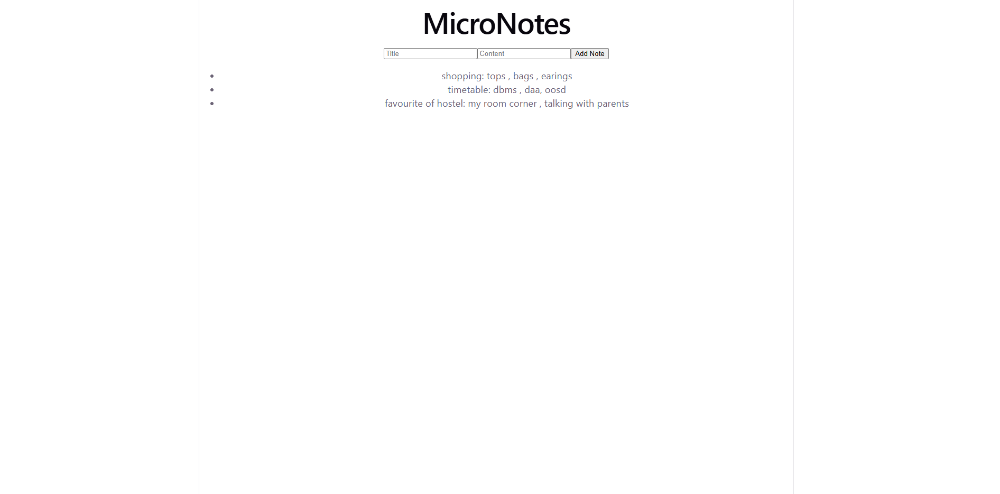

# MicroNotes

A small full-stack notes app built with React (frontend) and Express (backend). Type a note and it appears instantly in the list below, stored on the server while it's running.

## What it does
- Add a note (title + content)
- View all saved notes in a list
- Notes are stored in memory on the server (they reset when the server restarts)
## How to run it

**1. Start the server:**

    cd server
    npm install
    node server.js

Server runs on http://localhost:5000

**2. Start the client (in a separate terminal):**

    cd client
    npm install
    npm run dev

Client runs on http://localhost:5173

## Tech stack
- React (via Vite)
- Express
- Node.js
